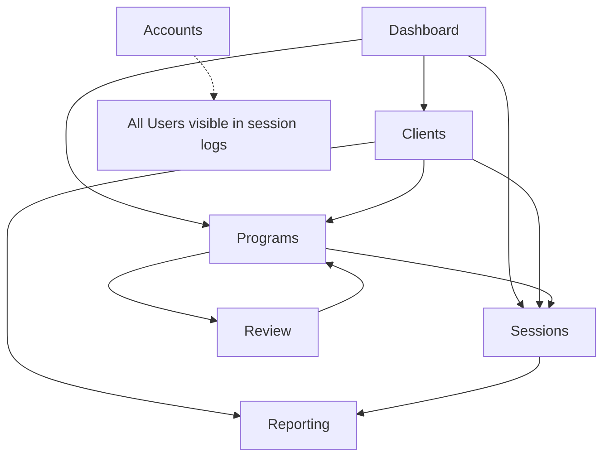

# SnapStim ProjectUI - Demo Integration Analysis & Implementation Plan

**Generated:** February 14, 2026  
**Purpose:** Comprehensive analysis of feature interactions, data flows, and required fixes for seamless demo experience  
**Audience:** Developers and stakeholders

---

## Table of Contents

1. [Executive Summary](#executive-summary)
2. [Application Architecture Overview](#application-architecture-overview)
3. [Feature Interaction Map](#feature-interaction-map)
4. [Data Consistency Issues](#data-consistency-issues)
5. [User Journey Flows](#user-journey-flows)
6. [Implementation Plan](#implementation-plan)
7. [Appendix: Quick Reference](#appendix-quick-reference)

---

## Executive Summary

### Current State
SnapStim ProjectUI is a fully-functional UI prototype with **7 major sections** and **mock JSON data**. While each section works independently, there are **critical data consistency issues** preventing seamless cross-section navigation and data flow.

### Key Findings
- ✅ **Working:** All individual section UIs render correctly
- ✅ **Working:** Basic navigation between sections
- ❌ **Broken:** ID mismatches between sections (3 different ID formats)
- ❌ **Broken:** Cross-section data lookups fail (sessions can't find clients)
- ❌ **Broken:** Demo user flows incomplete (can't follow client → program → session → report)

### Impact on Demo
**Without fixes:** Users will see "Unknown Client", broken links, and disconnected data when navigating between sections.  
**With fixes:** Seamless demo experience where users can follow a complete ABA therapy workflow from client onboarding to session completion to reporting.

---

## Application Architecture Overview

### Section Roster

| Section | Route | Primary Purpose | Data Dependencies |
|---------|-------|----------------|-------------------|
| **Dashboard** | `/` | Overview & alerts | Clients, Programs, Sessions |
| **Accounts** | `/accounts` | User management | Users only (standalone) |
| **Clients** | `/clients` | Client profiles & overview | Clients, Programs (nested), Alerts |
| **Programs** | `/programs` | Program library & details | Programs, Clients (for filtering) |
| **Review** | `/review` | AI stimulus approval | Stimuli, Programs, Clients (name lookup) |
| **Sessions** | `/sessions` | Conduct therapy sessions | Sessions, Clients, Programs (all) |
| **Reporting** | `/reporting` | Analysis & exports | Comments, Sessions, Clients, Programs |

### Data File Structure

```
product-plan/sections/
├── accounts/
│   ├── data.json          → users (ID: usr_1, usr_2, usr_3...)
│   └── types.ts
├── clients/
│   ├── data.json          → clients (ID: cli_1, cli_2, cli_3...)
│   │                      → programs (ID: prg_1, prg_2...)
│   │                      → alerts
│   └── types.ts
├── programs/
│   ├── data.json          → programs (ID: prg_1, prg_2, prg_3...)
│   └── types.ts
├── sessions/
│   ├── data.json          → sessions (ID: sess-001, sess-002...)
│   │                      → client_id: "client-001" ❌ MISMATCH
│   │                      → program_id: "prog-001" ❌ MISMATCH
│   │                      → therapist_id: "user-002" ❌ MISMATCH
│   └── types.ts
├── review/
│   ├── data.json          → review_queue (stimulus_id: stim_18)
│   │                      → program_id: prg_6 ✅ MATCHES
│   └── types.ts
└── reporting/
    ├── data.json          → comments, templates, exports
    │                      → client_id: cli_1 ✅ MATCHES
    │                      → program_id: prg_1 ✅ MATCHES
    └── types.ts
```

---

## Feature Interaction Map

### Cross-Section Dependencies



### Detailed Interactions

#### 1. **Dashboard → All Sections**
- **Displays:** Client alerts, program stats, recent sessions, AI insights
- **Actions:**
  - Click "needs attention" client → Should navigate to Clients view with that client selected
  - Click "Start New Session" → Navigate to Sessions
  - Click "View Reports" → Navigate to Reporting

**Current Status:** ✅ Displays data correctly | ❌ Navigation actions are console.log stubs

---

#### 2. **Clients → Programs, Sessions, Reporting**
- **Displays:** Client list, dashboard with programs and alerts
- **Actions:**
  - "Start Session" button → Should navigate to Sessions with client & program pre-selected
  - "Add Program" button → Should show program assignment modal or navigate to Programs
  - "View Reports" button → Should navigate to Reporting filtered by this client
  - "Edit Profile" button → Should open edit modal

**Current Status:** ✅ Displays data correctly | ❌ All action buttons are TODO stubs

**Data Issue:** Programs embedded in `clients/data.json` have correct IDs (`prg_1`) but sessions use wrong IDs (`prog-001`)

---

#### 3. **Programs → Sessions, Review**
- **Displays:** Program list with performance metrics
- **Actions:**
  - "Start Session" button (in ProgramDetail) → Should navigate to Sessions with program pre-selected
  - "Edit" button → Should open edit flow
  - Auto-redirects to Review after program creation (not implemented yet)

**Current Status:** ✅ Displays data correctly | ❌ Actions are TODO stubs

**Data Issue:** Review queue references programs correctly (`prg_6`) but sessions don't match

---

#### 4. **Sessions ← Clients, Programs**
- **Displays:** Client list with avatars, programs for selected client, recent sessions
- **Actions:**
  - Select client → Show their programs
  - Click "Start" on program → Create new session and enter SessionRunner
  - View recent session → Load SessionRecap
  - View history → Show SessionHistory

**Current Status:** 
- ✅ Client list displays with avatars (newly fixed)
- ✅ Programs filter by selected client
- ❌ **CRITICAL:** Recent sessions show "Unknown Client" because ID mismatch
- ❌ SessionHistory can't resolve client/program names

**Data Issue:** Session data uses:
- `client_id: "client-001"` but should be `"cli_1"`
- `program_id: "prog-001"` but should be `"prg_1"`
- `therapist_id: "user-002"` but should be `"usr_2"`

---

#### 5. **Review ← Programs**
- **Displays:** Queue of AI-generated stimuli awaiting approval
- **Actions:**
  - Approve stimulus → Mark approved, move to next
  - Reject stimulus → Mark rejected, trigger regeneration
  - Edit stimulus → Modify properties
  - Zoom stimulus → View full-size

**Current Status:** ✅ Works independently, program names resolve correctly

**Data Issue:** Uses correct program IDs (`prg_6`), no issues found

---

#### 6. **Reporting ← Clients, Programs, Sessions**
- **Displays:** 4 sub-tabs:
  - Comments: Role-based team communication
  - Progress Reports: Template-based report generation
  - Data Analytics: Charts and visualizations
  - Export Center: Data export jobs
- **Actions:**
  - Add comment with client/program/session context
  - Generate progress report for specific client/program
  - View analytics filtered by client or date range
  - Export data to CSV/PDF/JSON

**Current Status:** 
- ✅ Comments system uses correct IDs (`cli_1`, `prg_1`)
- ✅ All tabs render correctly
- ❌ Can't filter by client from Clients view (no navigation context)

**Data Issue:** No issues found in reporting data structure

---

## Data Consistency Issues

### Critical Issue #1: ID Format Mismatches

| Entity | Correct Format | Sessions Format | Match? |
|--------|---------------|-----------------|--------|
| Clients | `cli_1`, `cli_2`, `cli_3` | `client-001`, `client-002` | ❌ NO |
| Programs | `prg_1`, `prg_2`, `prg_3` | `prog-001`, `prog-002` | ❌ NO |
| Users | `usr_1`, `usr_2`, `usr_3` | `user-002`, `user-003` | ❌ NO |
| Sessions | N/A | `sess-001`, `sess-002` | N/A |
| Stimuli | `stim_18`, `stim_19` | N/A | N/A |

### Critical Issue #2: Missing Data Relationships

**Sessions data needs:**
- 7 sessions total in `sessions/data.json`
- Each session references non-existent client/program/user IDs
- No way to resolve to actual client names, avatars, or program details

**Impact:**
```typescript
// This lookup FAILS:
const client = clients.find(c => c.client_id === session.client_id)
// Because session.client_id = "client-001" but actual ID is "cli_1"
```

### Critical Issue #3: Incomplete Demo Data

**Current Coverage:**
- ✅ 5 clients defined
- ✅ 10+ programs defined
- ✅ 5+ users defined
- ❌ Only 7 sessions (should have 15-20 for rich demo)
- ❌ Sessions don't span all clients evenly
- ❌ No sessions for clients `cli_4` and `cli_5`

---

## User Journey Flows

### Flow 1: Monitor Client Progress (Dashboard → Clients → Sessions)

**Scenario:** BCBA reviews dashboard alerts and takes action

```
1. User lands on Dashboard
   → Sees "Needs Attention" alert for Liam Chen (declining performance)
   
2. User clicks alert
   ❌ BROKEN: Currently console.log, should navigate to Clients
   ✅ FIX: Navigate to /clients with cli_2 selected
   
3. User views Liam's dashboard in Clients
   → Sees 3 active programs, alerts showing declining trend
   → Reviews AI recommendation: "Review Listener Responding - intervention needed"
   
4. User clicks "Start Session" on Listener Responding program
   ❌ BROKEN: Currently console.log, no navigation
   ✅ FIX: Navigate to /sessions with cli_2 and prg_5 pre-selected
   
5. User arrives at Sessions view
   → Liam Chen is pre-selected in client list
   → Listener Responding program is highlighted
   → User clicks "Start" to begin session
```

**Current State:** 0% functional (no navigation works)  
**Required Fixes:** Dashboard alert click → Clients navigation → Sessions navigation with context

---

### Flow 2: Create and Run New Program (Programs → Review → Sessions)

**Scenario:** BCBA creates a new receptive labeling program

```
1. User navigates to Programs
   → Clicks "New Program" button
   ❌ BROKEN: Console.log stub
   ✅ FIX: Show program creation modal
   
2. User fills out program form
   - Client: Emma Rodriguez (cli_1)
   - Type: Receptive Labeling
   - Category: Food items
   - AI Generate Stimuli: Yes (15 images)
   
3. Program saves and redirects to Review
   ❌ NOT IMPLEMENTED: No redirect logic
   ✅ FIX: Navigate to /review with new stimuli queued
   
4. User reviews AI-generated food images
   → Approves 12, rejects 3
   → Clicks "Complete Review"
   
5. User navigates to Sessions
   → Selects Emma Rodriguez
   → New program appears in her program list
   → Clicks "Start" to run first session
```

**Current State:** 0% functional (creation not implemented)  
**Required Fixes:** Full program creation flow + review integration

---

### Flow 3: Complete Session and View Report (Sessions → Reporting)

**Scenario:** RBT completes a session and views data

```
1. User navigates to Sessions
   → Selects Emma Rodriguez (cli_1)
   → Selects "Tacting Colors" program (prg_2)
   → Clicks "Start"
   
2. SessionRunner loads
   → 10 trials with color stimuli
   → User records: 8 correct, 2 incorrect
   → Session ends, auto-navigates to SessionRecap
   
3. SessionRecap displays
   → 80% accuracy
   → Trial-by-trial breakdown
   → AI recommendation: "Good progress, continue program"
   → User clicks "Save & Exit"
   ❌ BROKEN: Alert popup, no save
   ✅ FIX: Save to sessions data, return to selection
   
4. User clicks "View Reports" from recap
   ❌ NOT IMPLEMENTED: No button exists
   ✅ FIX: Add button, navigate to /reporting with context
   
5. Reporting opens to Data Analytics tab
   → Filtered to Emma Rodriguez + Tacting Colors
   → Shows accuracy trend chart with new session data point
```

**Current State:** 40% functional (session runs but doesn't connect to reporting)  
**Required Fixes:** Session save logic + navigation to Reporting

---

### Flow 4: Team Communication (Reporting Comments)

**Scenario:** BCBA leaves note for RBT about client behavior

```
1. User navigates to Reporting
   → Clicks "Comments" tab
   
2. User filters comments
   → Client: Liam Chen (cli_2)
   → Program: All
   → Shows existing comments from other team members
   
3. User adds new comment
   → "Liam showed increased attention during sessions this week. 
      Continue reinforcement schedule. —Dr. Chen"
   → Visibility: BCBA + RBT (not caregiver)
   → Tags: [attention, reinforcement]
   
4. Comment saves and appears in thread
   ✅ WORKING: Comment system fully functional
   
5. RBT logs in later, sees comment notification
   ❌ NOT IMPLEMENTED: No notification system
   ❌ NOT IMPLEMENTED: No login/auth system
```

**Current State:** 70% functional (comment submission works, notification/auth doesn't exist)  
**Required Fixes:** Minor (notification badge in UserMenu if implementing)

---

## Implementation Plan

### Phase 1: Critical Data Fixes (Required for Demo)

**Priority:** 🔴 CRITICAL  
**Estimated Effort:** 2-3 hours  
**Impact:** Fixes all cross-section data lookups

#### Task 1.1: Fix Session Data IDs
**File:** `product-plan/sections/sessions/data.json`

**Changes Required:**
- Replace all `"client_id": "client-001"` → `"cli_1"`
- Replace all `"client_id": "client-002"` → `"cli_2"`
- Replace all `"client_id": "client-003"` → `"cli_3"`
- Replace all `"client_id": "client-004"` → `"cli_4"`
- Replace all `"client_id": "client-005"` → `"cli_5"`
- Replace all `"program_id": "prog-001"` → `"prg_1"`
- Replace all `"program_id": "prog-002"` → `"prg_2"`
- Replace all `"therapist_id": "user-002"` → `"usr_2"`
- Replace all `"therapist_id": "user-003"` → `"usr_3"`

**Expected Result:**
- SessionHistory will show correct client names with avatars
- Recent sessions will resolve properly
- Dashboard recent activity will display full details

---

#### Task 1.2: Add Missing Session Data
**File:** `product-plan/sections/sessions/data.json`

**Changes Required:**
- Add 3-5 sessions for `cli_4` (Sophia Martinez)
- Add 3-5 sessions for `cli_5` (Olivia Anderson)
- Ensure sessions use programs actually assigned to those clients
- Date sessions realistically (past 2 weeks)

**Expected Result:**
- All clients have representative session history
- Demo data feels complete and realistic

---

#### Task 1.3: Verify Review Data Integrity
**File:** `product-plan/sections/review/data.json`

**Status:** ✅ Already uses correct IDs (`prg_6`, etc.)  
**Action:** No changes needed, verify only

---

### Phase 2: Navigation Context Implementation

**Priority:** 🟡 HIGH  
**Estimated Effort:** 4-6 hours  
**Impact:** Enables cross-section navigation

#### Task 2.1: Create Navigation Context
**New File:** `src/contexts/NavigationContext.tsx`

**Purpose:** Shared navigation with state passing

```typescript
interface NavigationContextValue {
  navigateTo: (path: string, context?: NavigationContext) => void;
  context: NavigationContext | null;
}

interface NavigationContext {
  clientId?: string;
  programId?: string;
  sessionId?: string;
  [key: string]: any;
}
```

**Integration Points:**
- Wrap `<App>` with context provider
- Pass `navigateTo` to all section views
- Views can set context when navigating

---

#### Task 2.2: Update Dashboard Navigation
**File:** `src/sections/dashboard/DashboardView.tsx`

**Changes:**
- Import `useNavigation()` hook
- Replace `console.log` in alert clicks with `navigateTo('/clients', { clientId })`
- Replace quick action buttons with navigation calls

---

#### Task 2.3: Update Clients Navigation
**File:** `src/sections/clients/ClientsView.tsx`

**Changes:**
- Add `navigateTo` to component props
- "Start Session" → `navigateTo('/sessions', { clientId, programId })`
- "View Reports" → `navigateTo('/reporting', { clientId })`
- "Add Program" → Show modal (future work)

---

#### Task 2.4: Update Programs Navigation
**File:** `src/sections/programs/ProgramsView.tsx`

**Changes:**
- "Start Session" → `navigateTo('/sessions', { programId })`
- Retrieve clientId from program data
- Pass full context

---

#### Task 2.5: Update Sessions Context Handling
**File:** `src/sections/sessions/SessionsView.tsx`

**Changes:**
- Read context from NavigationContext
- Pre-select client if `context.clientId` exists
- Pre-select program if `context.programId` exists
- Highlight pre-selected items in UI

---

### Phase 3: Feature Completions

**Priority:** 🟢 MEDIUM  
**Estimated Effort:** 6-8 hours  
**Impact:** Polishes demo experience

#### Task 3.1: Implement Create Buttons
- Clients: "Add Client" → Modal form
- Programs: "New Program" → Modal or dedicated page
- Accounts: "Add User" → Modal form

#### Task 3.2: Implement Edit Modals
- Account edit
- Client profile edit
- Program edit (from ProgramDetail)

#### Task 3.3: Implement Session Save
- Save completed session to local state or localStorage
- Update SessionHistory with new session
- Show success message

#### Task 3.4: Add Navigation from SessionRecap
- "View Full Report" button → Navigate to Reporting with session context

---

### Phase 4: Polish & Documentation

**Priority:** 🔵 LOW  
**Estimated Effort:** 2-3 hours  
**Impact:** Professional finish

#### Task 4.1: Add Loading States
- Skeleton loaders for data-heavy views
- Transitions between views

#### Task 4.2: Add Empty States
- Better messaging when no data exists
- Call-to-action buttons

#### Task 4.3: Add Confirmation Modals
- Confirm delete/deactivate actions
- Prevent accidental data loss

#### Task 4.4: Update User Documentation
- Demo walkthrough guide
- Feature interaction diagram
- Common workflows

---

## Appendix: Quick Reference

### ID Lookup Table

| Client Name | Client ID | User (Therapist) | User ID | Example Programs |
|-------------|-----------|------------------|---------|------------------|
| Emma Rodriguez | `cli_1` | Dr. Sarah Chen | `usr_1` | `prg_1`, `prg_2`, `prg_3`, `prg_4` |
| Liam Chen | `cli_2` | Mike Johnson (RBT) | `usr_2` | `prg_5`, `prg_6`, `prg_7` |
| Sophia Martinez | `cli_3` | Emma Davis (Caregiver) | `usr_3` | `prg_8`, `prg_9` |
| Marcus Thompson | `cli_4` | Dr. Sarah Chen | `usr_1` | `prg_10` |
| Olivia Anderson | `cli_5` | Dr. Sarah Chen | `usr_1` | (Add programs) |

### File Change Summary

| File | Changes Needed | Priority | Complexity |
|------|---------------|----------|------------|
| `sessions/data.json` | Replace all IDs | 🔴 CRITICAL | Low (Find/Replace) |
| `sessions/data.json` | Add 6-10 sessions | 🔴 CRITICAL | Medium (Copy/Modify) |
| `DashboardView.tsx` | Add navigation | 🟡 HIGH | Low |
| `ClientsView.tsx` | Add navigation | 🟡 HIGH | Low |
| `ProgramsView.tsx` | Add navigation | 🟡 HIGH | Low |
| `SessionsView.tsx` | Handle context | 🟡 HIGH | Medium |
| `NavigationContext.tsx` | Create context | 🟡 HIGH | Medium |
| Various | Create/Edit modals | 🟢 MEDIUM | High |

### Testing Checklist

After implementing fixes, verify these user flows:

- [ ] Dashboard alert click → Opens Clients with correct client
- [ ] Clients "Start Session" → Opens Sessions with client + program
- [ ] Programs "Start Session" → Opens Sessions with program
- [ ] Sessions history → Shows correct client names and avatars
- [ ] SessionRecap → Can navigate to Reporting
- [ ] Reporting → Can filter by client/program from other sections
- [ ] Review → Displays correct program names
- [ ] Dashboard recent activity → Shows full session details

---

## Next Steps

**Recommended Approach:**

1. **Immediate:** Fix sessions/data.json IDs (30 minutes, huge impact)
2. **Short-term:** Implement basic navigation context (2-3 hours)
3. **Medium-term:** Wire up all navigation points (2-3 hours)
4. **Later:** Add create/edit features (6-8 hours)

**Which phase would you like to tackle first?**

---

*Document maintained by: AI Assistant*  
*Last updated: February 14, 2026*
